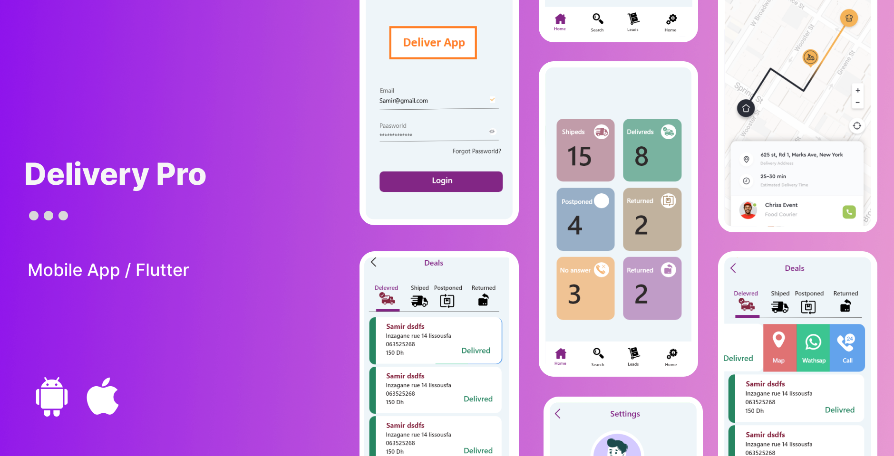

# DeliveryPro App

## About
DeliveryPro is a Flutter app designed to streamline the management of delivery leads. It allows you to easily view and update the status of your delivery tasks, making your delivery workflow more efficient.

## Features
- View a list of all delivery leads.
- Change the status of delivery leads (e.g., Pending, In Progress, Delivered).

## Getting Started
To get started with DeliveryPro, follow these steps:

1. Clone this repository.
2. Install Flutter and Dart if you haven't already.
3. Run `flutter pub get` to install dependencies.
4. Modify the app to suit your specific needs.
5. Run the app on your preferred emulator or physical device.

## License
This project is licensed under the MIT License - see the [LICENSE](LICENSE) file for details.
